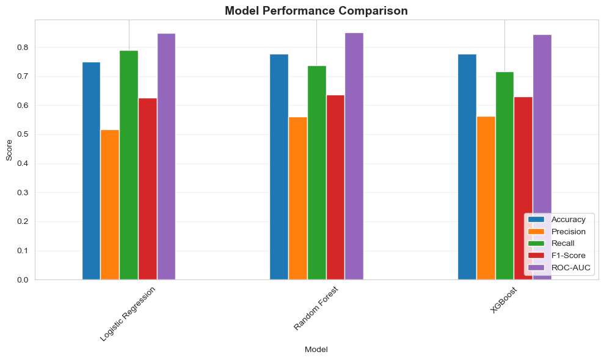
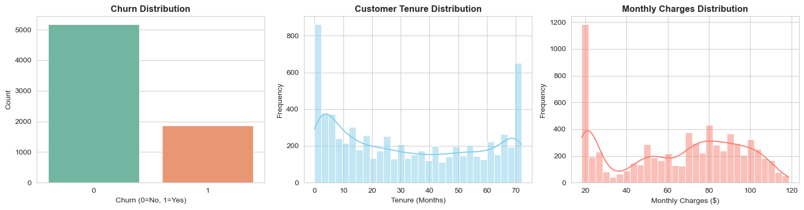
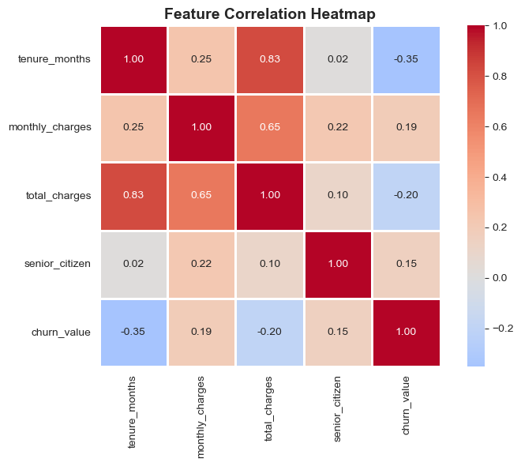
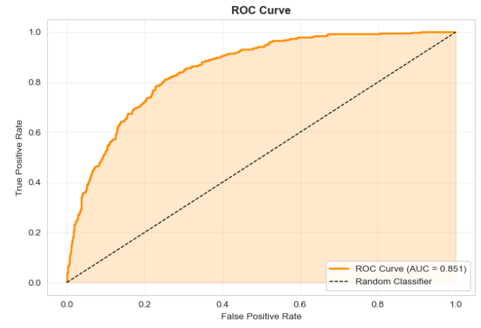
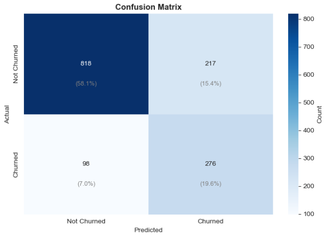

# Customer-Churn-Prediction
This project focuses on predicting customer churn using machine learning techniques, with special emphasis on handling class imbalance and evaluating models using business-critical metrics such as recall, F1-score, and ROC-AUC instead of accuracy alone.

# 📉 Customer Churn Prediction using Machine Learning

## 🔍 Project Overview
Customer churn prediction is a **real-world imbalanced classification problem** where the primary goal is to correctly identify customers who are likely to leave a service.

This project builds an **end-to-end churn prediction pipeline**, including data preprocessing, feature engineering, class imbalance handling, and training multiple machine learning models.  
Rather than optimizing only for accuracy, the project prioritizes **recall and F1-score**, as missing a churned customer is more costly than incorrectly flagging a loyal one.

---

## 🎯 Objectives
- Analyze customer behavior and service usage patterns  
- Engineer meaningful features to improve churn prediction  
- Handle class imbalance effectively during model training  
- Train and compare multiple machine learning models  
- Evaluate models using **Recall, F1-score, and ROC-AUC**  
- Identify the most suitable model for real-world churn prevention  

---

## ⚙️ Tech Stack
- **Language:** Python 3  
- **Environment:** Jupyter Notebook  
- **Libraries Used:**
  - `pandas`, `numpy` – data processing and feature engineering  
  - `matplotlib`, `seaborn` – data visualization  
  - `scikit-learn` – model training and evaluation  
  - `xgboost` – gradient boosting model  

---

## 📁 Dataset Description
- **Total Rows:** 7,043  
- **Original Features:** 33  
- **Final Features (after engineering):** 39  

### Data Types
- Object: 24  
- Integer: 6  
- Float: 3  

### Missing Values
- **Total missing values:** 5,174  

### Churn Distribution
- **Not Churned:** 5,174 (73.46%)  
- **Churned:** 1,869 (26.54%)  

➡️ The dataset is **class-imbalanced**, making accuracy an unreliable standalone metric.

---

## 🛠️ Feature Engineering
The following features were created to improve model performance:
- `tenure_group`
- `charge_group`
- `total_services`
- `value_score`

**New dataset shape:** `(7043, 39)`

---

## ⚙️ Data Preparation
- Train–test split (80–20)
- Encoding of categorical variables
- Feature scaling
- Class imbalance handling during training

**Training set:** `(5634, 38)`  
**Test set:** `(1409, 38)`

---

## 🤖 Models Trained
- Logistic Regression  
- Random Forest  
- XGBoost  

All models were trained with **class imbalance handling enabled**.

---

## 📈 Model Performance Comparison

| Model | Accuracy | Precision | Recall | F1-Score | ROC-AUC |
|------|---------|----------|--------|---------|--------|
| Logistic Regression | 0.7488 | 0.5175 | **0.7888** | 0.6250 | 0.8492 |
| Random Forest | **0.7764** | 0.5598 | 0.7380 | **0.6367** | **0.8512** |
| XGBoost | 0.7771 | **0.5630** | 0.7166 | 0.6306 | 0.8431 |

🏆 **Best Model:** Random Forest (based on F1-score and ROC-AUC)
- **Model Comparison**  
  

---

## 🔍 Why Accuracy Is Not the Main Metric
In churn prediction:
- Accuracy can be misleading due to class imbalance  
- **Recall for churned customers is more important**

This project prioritizes identifying churned customers even at the cost of slightly lower accuracy, making the model **business-relevant and practical**.

---

## 📊 Demo & Visualizations
The following visualizations are available in the `assets/` folder:

- **Churn Distribution**  
  

- **Feature Importance**  
  

- **ROC Curve**  
  

- **Confusion Matrix**  
  

---

## 🧩 Key Insights
- Class imbalance significantly affects churn prediction  
- Accuracy alone is not sufficient for evaluating churn models  
- Random Forest provides the best balance between recall and precision  
- The model successfully identifies a large portion of churned customers  

---

## 🚀 Future Enhancements
- Decision threshold optimization  
- SHAP-based model explainability  
- Cost-sensitive learning  
- Deployment using Streamlit or Flask  

---

## 🗂️ Project Structure
📦 Customer-Churn-Prediction  
- ┣ 📜 churn_prediction.ipynb  
- ┣ 📊 dataset.csv  
- ┣ 📁 assets  
- ┃ ┣ churn_distribution.png  
- ┃ ┣ feature_importance.png  
- ┃ ┣ roc_curve.png  
- ┃ ┣ confusion_matrix.png  
- ┃ ┗ precision_recall_curve.png  
- ┣ 📄 README.md  

---

⭐ If you find this project useful, consider giving it a star!
